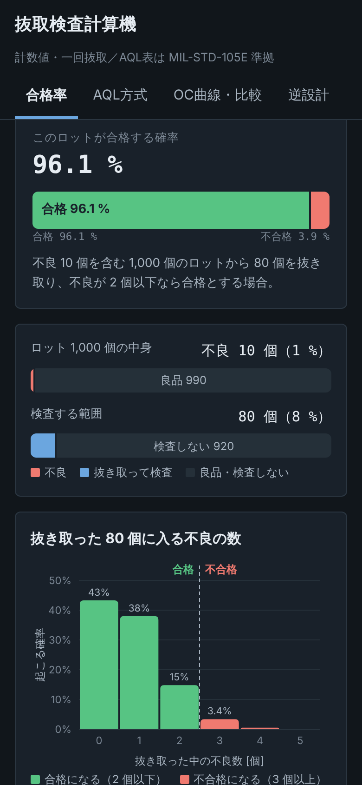
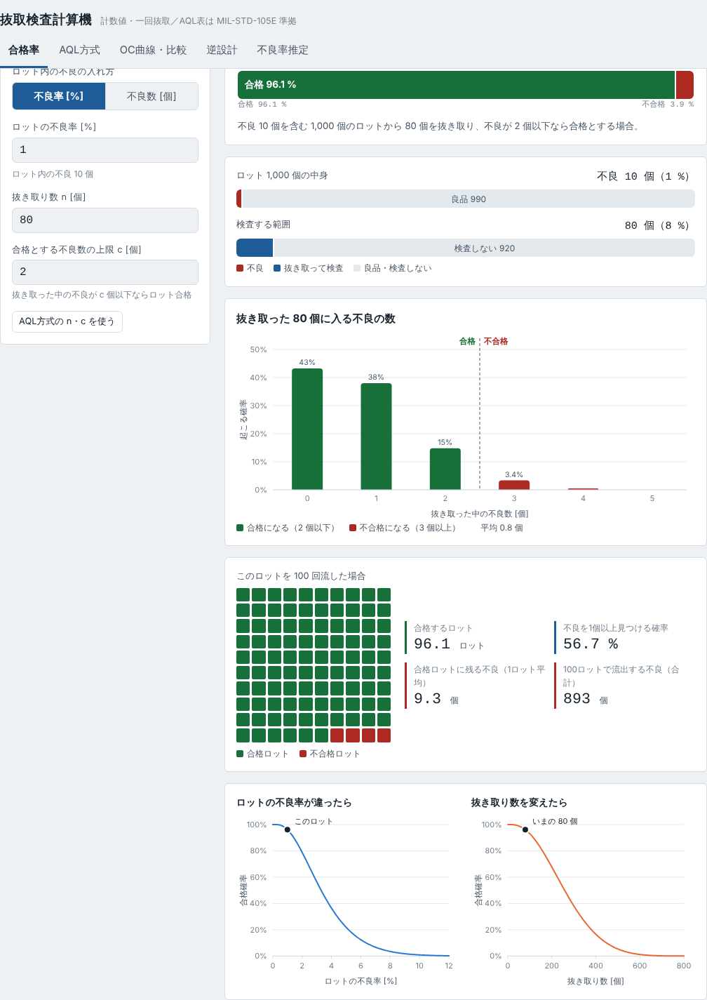
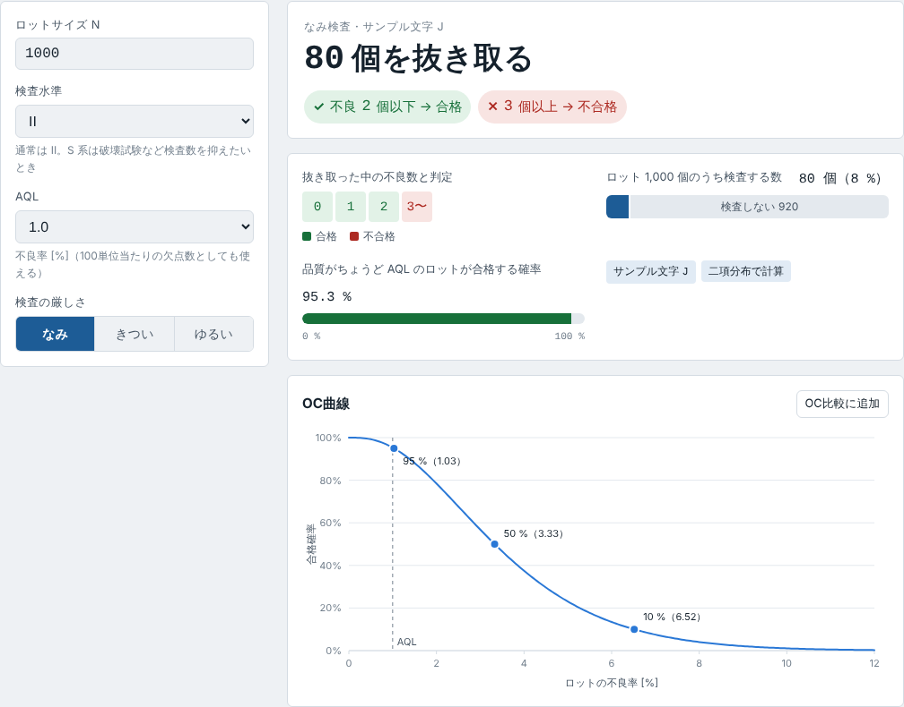
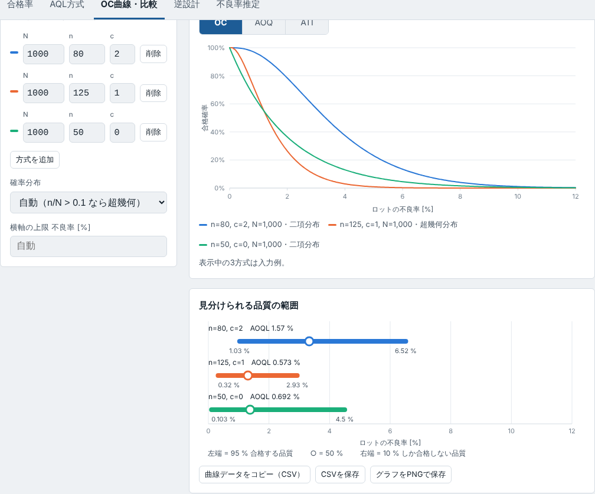
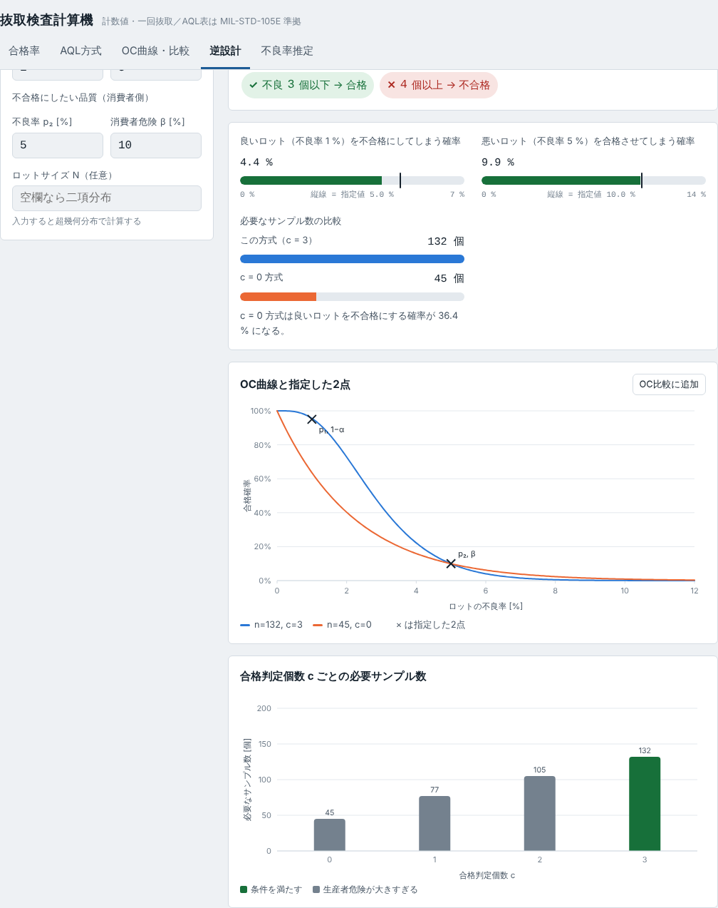
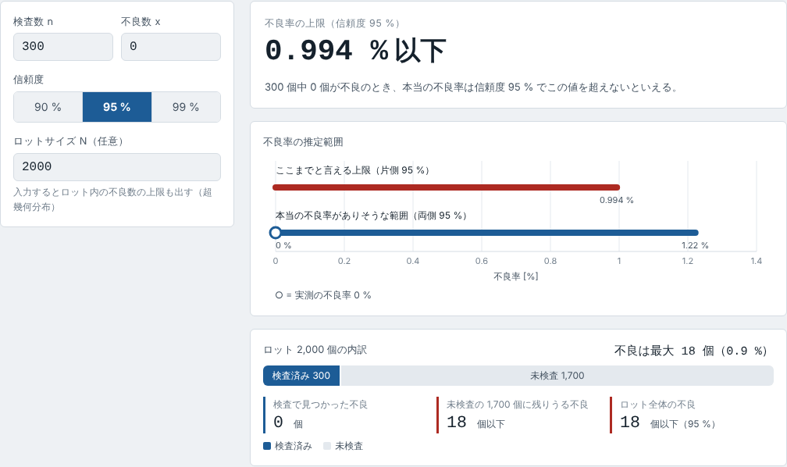

# 抜取検査計算機（sampling-calc）

ロットから何個か抜き取って検査するときに、「このロットはどれくらいの確率で合格するか」「何個抜けばいいか」を計算するツールです。結果はグラフで表示します。

**今すぐ使う → https://kotaooka.github.io/sampling-calc/**

- ブラウザだけで動きます。インストールやユーザー登録は不要です
- 入力した数値はお使いの端末の中だけで計算し、外部には送信しません
- スマホ・タブレット・PC のどれでも使えます

---

## できること

画面上部のタブで計算の種類を切り替えます。

### 合格率 ― このロットは合格する？

ロットの大きさ、ロットに含まれる不良、抜き取る数、合格の基準を入れると、そのロットが合格する確率を出します。

| 入れるもの | 例 |
|---|---|
| ロットサイズ | 1,000 個 |
| ロット内の不良 | 不良率 1 % または 不良数 10 個（ボタンで切り替え） |
| 抜き取り数 | 80 個 |
| 合格とする不良数の上限 | 2 個（抜き取った中の不良が 2 個以下なら合格） |

この例では「合格する確率 96.1 %」と出ます。あわせて次のグラフを表示します。

- 抜き取った中に不良が何個入りそうか
- 同じロットを 100 回流したら何回合格するか、合格して出荷されてしまう不良は何個か
- 抜き取り数や不良率を変えると、合格する確率がどう変わるか

### AQL方式 ― 規格の表で何個抜けばいい？

ロットサイズ・検査水準・AQL を選ぶと、抜取検査の規格表（MIL-STD-105E）から「何個抜き取って、不良が何個以下なら合格か」を引きます。表の矢印の読み替えも自動で行います。

### OC曲線・比較 ― どの抜き取り方が良い？

抜き取り方を最大 3 つ並べて、不良率ごとの合格確率（OC曲線）を比べます。出荷される品質（AOQ）や平均検査数（ATI）のグラフにも切り替えられます。

### 逆設計 ― 条件から抜き取り方を決める

「不良率 1 % のロットは 95 % 以上合格させたい」「不良率 5 % のロットは 10 % 以下しか合格させたくない」のように条件を入れると、それを満たす最小の抜き取り数と合格基準を求めます。

### 不良率推定 ― 検査結果から本当の不良率は？

「300 個検査して不良 0 個だった」のような結果から、本当の不良率がどこまで高い可能性があるかを出します。ロットサイズを入れると、検査していない残りに不良が最大何個ありうるかも出します。

---

## アプリとして入れる（オフラインでも使えます）

ホーム画面やデスクトップに追加すると、アプリのように起動でき、一度開いたあとは通信がなくても使えます。

| 端末 | やり方 |
|---|---|
| Android（Chrome） | メニュー（︙）→「アプリをインストール」または「ホーム画面に追加」 |
| iPhone・iPad（Safari） | 共有ボタン →「ホーム画面に追加」 |
| Windows・Mac（Chrome / Edge） | アドレスバー右端のインストールボタン |

新しい版が公開されると、次に開いたときに自動で取り込みます。画面に「開き直すと反映される」と出たら、一度閉じて開き直してください。

---

## 便利な使い方

- **条件の共有**：入力した条件はページのアドレス（URL）に保存されます。アドレスをそのまま送れば、相手も同じ条件の計算結果を見られます
- **グラフの数値を見る**：グラフにカーソルを乗せる（スマホならタップする）と、その点の数値が出ます
- **データの持ち出し**：「OC曲線・比較」タブでは、グラフのデータを CSV でコピー・保存したり、グラフを PNG 画像で保存したりできます

---

## 使うときの注意

- **AQL は「ロットの品質を保証する値」ではありません**。品質がちょうど AQL のロットでも、合格する確率は 90〜99 % 程度で、AQL より悪いロットもある確率で合格します。実際にどれくらい合格するかは「合格率」タブや OC曲線で確認してください
- **AQL の表は MIL-STD-105E（米国防総省規格、1989 年）に基づいています**。現行の JIS Z 9015-1:2006（ISO 2859-1:1999）とは、ゆるい検査の表と、なみ・きつい・ゆるいを切り替えるルールが異なります。JIS に従って運用する場合は、JIS 本文で確認してください
- **流出する不良の数**は「不合格になったロットは出荷しない」前提の値です
- 計算結果は、検査方式を決めるときの判断材料としてお使いください

---

## 開発者向けの情報

ファイル構成、更新して公開する手順、計算方法、AQL表データの出典、テストについては [DEVELOPMENT.md](DEVELOPMENT.md) を参照してください。
